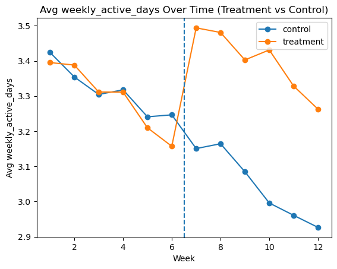

# Evaluating the Causal Impact of Engagement Nudges in an Education Platform

## At a glance

- **Question:** Do engagement nudges increase how often students use an education platform, and for whom?
- **Approach:** Randomized experiment analyzed with difference-in-differences, plus validation checks and a robustness check (Python, pandas, statsmodels)
- **Result:** Nudged students were active about 0.37 more days per week (about 11% more), with larger gains for less-engaged students
- **Data:** Synthetic, with known effects built in, so the estimates can be checked against the true answer. They land close to it.

*The two groups track closely for six weeks, then separate as soon as the nudges begin.*

## Overview

This project walks through how to evaluate whether an engagement nudge changes student activity on an education platform, using a randomized design and difference-in-differences (DiD). It estimates the average effect on weekly activity, checks whether the effect differs by students' starting engagement, and tests the assumptions DiD relies on.

The data are synthetic, with known effects built in. That makes the project a demonstration of the method: because the true effects are known, it's possible to check whether the analysis recovers them. It does not make claims about real students.

## Key results

- Nudged students were active about **0.37 more days per week** than the control group (95% CI: 0.32 to 0.42). That's about an **11% lift** over the control group's pre-period average of 3.3 days.
- The effect was larger for students who started out less engaged: about **0.54 days per week** for students averaging under 3 active days, compared with **0.30** for everyone else.
- Over the six post-period weeks, that's roughly **2.2 extra active days per student** on average and about **3.2** for low-engagement students. These totals assume a steady weekly effect and full observation, so they're approximate.
- Assignments completed and an engagement index rose about 10 to 11%. Assessment scores rose about 1.4 points, only about 2%.
- A student-level robustness check, which counts each student once, gives the same estimate (0.37) with a nearly identical range (0.33 to 0.42).

**How these compare to the built-in effects:** the data were generated with an average effect of about 0.36 active days (after a 7-day weekly cap), a larger effect for low-engagement students, and about 1.4 assessment points on average. The estimates land close to those values, which is the main thing this project shows.

## Questions

- Did the nudge change weekly activity, and by how much in practical terms?
- Does the effect differ by students' baseline engagement?
- Do the checks DiD relies on (balance, parallel pre-trends, placebo) hold up?

## Data

### Synthetic dataset

Real student-level experimental data weren't available for privacy reasons, so this project uses a synthetic dataset generated in `01_data_generation.ipynb`. The generation process includes:

- a gradual decline in activity across all 12 weeks, for both groups
- a built-in treatment effect of +0.30 active days, larger (+0.60) for low-baseline-engagement students and smaller (+0.10) for high-baseline-engagement students, capped at 7 days per week
- a built-in assessment effect of +1.2 points, larger (+1.8) for low-baseline-engagement students
- identical pre-period trends for treatment and control
- missing student-weeks and random noise

### Structure

- Student-week panel: 90,761 rows for 8,000 students (4,005 control, 3,995 treatment)
- 12 weeks: weeks 1 to 6 are the pre-period, weeks 7 to 12 the post-period
- Unbalanced panel: a fully observed panel would have 96,000 rows

## Methodology

### Experimental design

- Stratified randomization within grade level × SES band (21 strata). In odd-sized strata, the extra student goes to control, which produces the 4,005 / 3,995 split.
- Baseline balance checks on grade, SES, baseline score, and baseline engagement

### Validation (notebook 02)

- Pre-period trend test: difference in weekly slopes of −0.015 days (p = 0.17)
- Placebo DiD with a fake intervention at week 4: −0.046 days (p = 0.21)

Both checks pass, but they pass by construction, since the data were generated with identical pre-period trends. They show the tests behave as expected, not that parallel trends would hold in real data.

### Models (notebook 03)

- Panel DiD regression with grade-level and SES controls
- Heterogeneity analysis using a three-way interaction with a low-baseline-engagement flag (under 3.0, the same threshold used in data generation)
- Student-level pre/post change scores as a robustness check

### Standard errors

All models use heteroskedasticity-robust (HC3) standard errors. The panel models are not clustered by student, even though each student contributes up to 12 weeks. The student-level robustness check, which has one row per student, produces a nearly identical confidence interval, so this choice doesn't appear to affect the conclusions here.

## Repository structure

- `data/`
  - `synthetic_student_week_data.csv`
- `images/`
  - `weekly_trends.png`
- `notebooks/`
  - `01_data_generation.ipynb`: builds the synthetic dataset and documents the built-in effects
  - `02_experimental_validation.ipynb`: baseline balance, pre-period trends, and placebo test
  - `03_difference_in_differences.ipynb`: main DiD estimate, secondary outcomes, heterogeneity, robustness check, and cumulative effects
- `README.md`

## Interpretation

If a real study found this pattern, it would be worth testing a rollout focused on less-engaged students. The analysis can't say whether targeting beats a full rollout, though: every group benefited, and costs aren't measured. The larger effect for low-engagement students was built into the data, so this project recovers that difference rather than discovering it.

## Limitations

- **Synthetic data.** All effects, including the heterogeneity, were built in. Results show the method works on data with known answers, not how nudges affect real students.
- **Validation passes by construction.** The pre-trend and placebo tests couldn't have failed given how the data were generated.
- **Standard errors are not clustered by student** in the panel models (see above).
- **Pre-specified subgroup threshold.** The 3.0 cutoff matches the data-generation threshold. With real data, choosing a cutoff after seeing results risks finding spurious subgroup effects.
- **Short-term outcomes only.** Longer-term academic effects aren't evaluated.
- **No cost data**, so conclusions are about effectiveness, not cost-effectiveness.

## Author

Created by a former middle school, high school, and AP social studies teacher transitioning into data science and EdTech.
